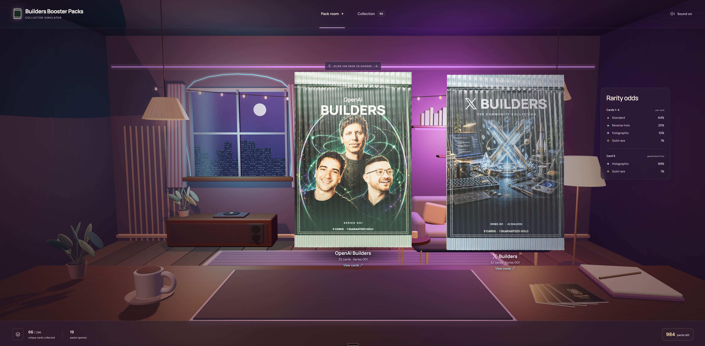

[](https://builders-booster-packs.itssotsot.chatgpt.site)

# Builders Booster Packs

**[Play now →](https://builders-booster-packs.itssotsot.chatgpt.site)**

A Three.js collectible-card experience with **OpenAI Builders** and **X Builders**
pack editions. Tear a foil wrapper, reveal five illustrated builders, and collect
standard, reverse holographic, holographic, and gold cards in a rainy, cozy 3D room.

This is an unofficial fan project. Card abilities and stats are fictional.
See [asset provenance and licensing](ASSETS.md).

## Run locally

Requires Node.js **22.13 or newer** (Node.js 24 is recommended).

```sh
npm ci
npm run dev
```

Open http://localhost:5198. No credentials or hosting account are needed locally.
The API stores anonymous collections in the ignored `.data/collections.sqlite`.

```sh
npm test        # Pack generation, API, persistence, and concurrency tests
npm run build   # Client in dist/client and Worker in dist/server/index.js
npm run preview # Preview with the local SQLite API
npm run check   # Tests followed by a production build
```

## Play

- Choose an edition, drag across the foil seal, and tap each card to reveal it.
- Drag a revealed card to tilt it; tap again to advance.
- Open Collection to filter finishes, inspect cards, and flip them over.
- Use Enter / Space to open and advance, arrow keys to tilt, M for sound,
  and Escape to close dialogs.
- Drag the room background to look around. Reduced-motion preferences shorten
  transitions and disable ambient motion and reveal particles.

Each pack contains five different people. The first four slots use 64% standard,
25% reverse holo, 10% holographic, and 1% gold odds; the fifth uses 99%
holographic and 1% gold odds. Both editions share the player's allowance.

## Persistence

The server generates packs, deducts the allowance, and saves all five cards in
one transaction. Request receipts make retries safe. Reloading preserves the
collection but does not resume the reveal sequence.

An opaque HttpOnly, SameSite cookie identifies the player. The database stores a
hash of the session token. Clearing the cookie or switching browsers starts a
new player; there is no sign-in or recovery flow. No purchases or trades exist.

## Hosting

For OpenAI Sites, copy the example and set your own project ID:

```sh
cp .openai/hosting.example.json .openai/hosting.json
```

`db/schema.ts` defines the schema. After schema changes, run
`npm run db:generate` and review the generated SQL. Local development applies
migrations automatically. A local build does not deploy or modify hosted data.

## Development

- `src/`: scene, card rendering, input, roster, and browser API client.
- `server/`: Worker API, collection transactions, and local SQLite adapter.
- `db/` and `drizzle/`: schema and migration history.
- `tests/`: automated tests and [historical browser QA notes](tests/QA.md).

The renderer requires WebGL. Audio is synthesized after a user gesture; Google
Fonts are used when available, with local fallbacks.

The nested esbuild dependency used by Drizzle's legacy loader is overridden to
`^0.28.2` to avoid its older vulnerable development server implementation.

## License

Original code and documentation use the [MIT license](LICENSE). Visual assets,
reference photos, logos, and trademarks are excluded; see [ASSETS.md](ASSETS.md).
